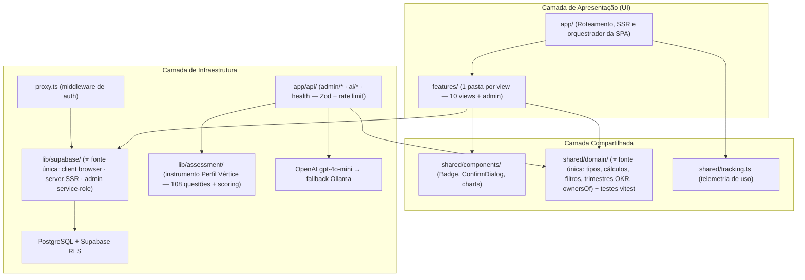
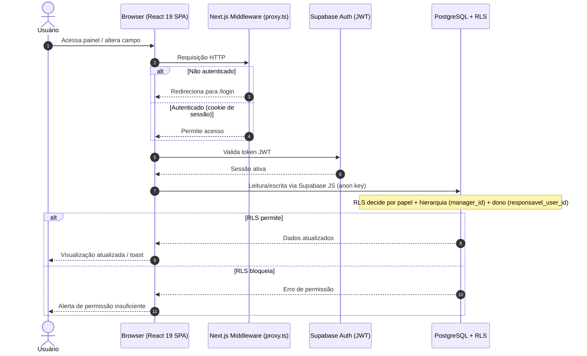

# Arquitetura do Sistema — Report Executivo Qualidade

Este documento detalha os padrões arquiteturais, a distribuição de camadas e os fluxos de dados adotados no **Report Executivo Qualidade**.

---

## 1. Visão Geral da Arquitetura

O projeto adota uma arquitetura **Feature-Folder com Layering Limpo**: cada view da SPA vive isolada em `features/`, a lógica de negócio é pura e centralizada em `shared/domain`, e a infraestrutura (clientes Supabase, instrumento Vértice) vive em `lib/`.

---

## 2. Padrões de Layering (Diretrizes de Dependência)

1. **Features → Shared/Lib (`features/*` → `shared/*`, `lib/*`):** views importam domínio, componentes e clientes.
2. **Shared NUNCA importa de Features:** a camada compartilhada é agnóstica e reutilizável.
3. **Features NUNCA importam de outras Features:** lógica comum é promovida para `shared/`.
4. **Aliases `@/*` sempre** (`@/features/...`, `@/shared/...`, `@/lib/...`) — nunca `../../..`.
5. **Uma cópia só:** o domínio vive em `shared/domain` e os clientes Supabase em `lib/supabase`. (Os espelhos históricos `lib/domain` e `shared/supabase` foram removidos em 2026-06-11 — não recriar.)
6. **Nova lógica de cálculo entra em `shared/domain` COM teste** em `shared/domain/*.test.ts` (vitest roda no CI).
7. **Nomes de responsáveis** passam sempre pelo chokepoint `ownersOf()` (canonicalização contra o cadastro via `setCanonicalOwners`) — nunca matching ad-hoc por substring.

---

## 3. Fluxo de Dados Executivo

O CRUD de dados **não tem endpoints REST próprios** — o RLS é a camada de autorização. Endpoints de API existem apenas onde a service role (administração de usuários) ou a chave de IA (laudo Vértice, resumo de 1:1) são necessárias — ver [api.md](./api.md).

---

## 4. Segurança de Banco de Dados (Row Level Security)

Toda tabela tem RLS ativa. Três mecanismos se combinam:

### 4.1. Permissão por papel (itens da carteira, gains, comments)

- **Editam** (`canEdit`): `admin`, `superintendente`, `gerente`, `coordenador`, `consultor`, `lider`, `analista`
- **Arquivam/excluem** (`canDelete`): `admin`, `superintendente`, `gerente`, `coordenador`, `lider`
- **Gestão de pessoas/capacidade** (`canManagePeople`): `admin`, `superintendente`, `gerente`, `coordenador`, `lider`
- **`viewer`**: somente leitura
- **`admin`**: além do acima, gestão de usuários e produtos

### 4.2. Tenancy de OKR por dono (migrations 015/017/018/019)

- O vínculo autoritativo é a FK `okr_targets.responsavel_user_id` — nunca matching por nome.
- O dono lança a apuração do **próprio** OKR; `admin`/`superintendente` homologam.
- Trigger `protect_okr_audit_fields`: campos de auditoria são blindados para não-privilegiados, e alterar resultado/evidência **re-pendencia** a homologação automaticamente (sem bloquear o valor, que sempre conta).

### 4.3. Hierarquia por gestor imediato (migration 021)

- `is_subordinate_or_self(uuid)`: fechamento **transitivo** de `manager_id` (`WITH RECURSIVE`).
- Desenvolvimento (avaliações Vértice, PDIs, atas de 1:1): cada gestor enxerga apenas a própria árvore; `admin`/`superintendente` enxergam tudo; a avaliação científica é auto-administrada (escrita = self).

### 4.4. Lições de implementação (não repetir)

- Funções helper são `SECURITY DEFINER` com `SET search_path = public`.
- Função usada em **expressão de policy** precisa de `GRANT EXECUTE TO authenticated` (migration 018); função de **trigger** não deve ser executável via RPC (migration 011).
- O app salva via `.upsert()` — policies de quem escreve precisam cobrir `INSERT` além de `UPDATE` (lição da migration 015).

---

## 5. Observabilidade e Operação

- **Health check** `/api/health` (versão + conectividade) — usado pelo smoke test do deploy.
- **Telemetria de uso** (`shared/tracking.ts`): `daily_access` (acesso diário com throttle) + `portfolio_snapshots` (snapshot lazy da carteira) alimentam o painel de aderência de uso da aba Executivo.
- **Sentry** (client/server/edge) com guard de DSN — inerte sem `SENTRY_DSN`.
- **CI:** lint → typecheck → vitest → build a cada push/PR; deploy automático na Vercel com env vars geridas pela integração Supabase↔Vercel.
