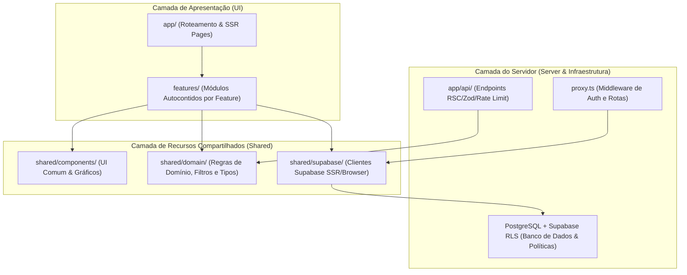
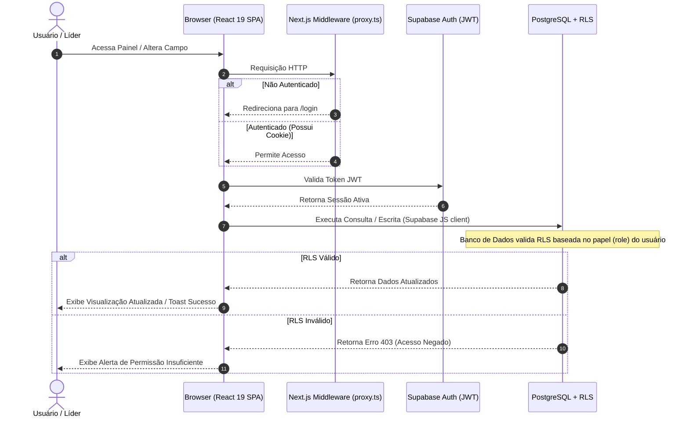

# Arquitetura do Sistema — Report Executivo Qualidade

Este documento detalha os padrões arquiteturais, a distribuição de camadas e os fluxos de dados adotados no **Report Executivo Qualidade**.

---

## 1. Visão Geral da Arquitetura

O projeto adota uma arquitetura baseada em **Feature-Folder com Layering Limpo**, garantindo isolamento de regras de negócios, manutenibilidade facilitada e baixo acoplamento entre as diferentes frentes do sistema.

---

## 2. Padrões de Layering (Diretrizes de Dependência)

Para evitar dependências acíclicas e código espaguete, as seguintes regras de importação são aplicadas rigorosamente:

1. **Features para Shared (`features/*` → `shared/*`):** Componentes em `features/` podem importar helpers de domínio, clientes de API e componentes visuais genéricos de `shared/`.
2. **Shared NUNCA importa de Features (`shared/*` ↛ `features/*`):** A camada compartilhada deve ser completamente agnóstica e reutilizável.
3. **Features NUNCA importam de outras Features (`features/A` ↛ `features/B`):** Se duas frentes precisam compartilhar lógica ou elementos gráficos, estes devem ser promovidos à camada `shared/`.
4. **Respeito aos Aliases `@/*`:** Todas as importações devem utilizar o path alias padrão configurado no `tsconfig.json` (`@/features/...`, `@/shared/...`, `@/server/...`) em vez de referências relativas profundas (`../../..`).

---

## 3. Fluxo de Dados Executivo

O fluxo de dados da aplicação funciona de forma assíncrona baseada na autenticação e segurança robusta do Supabase:

---

## 4. Segurança de Banco de Dados (Row Level Security)

Toda a persistência e escrita de dados no Postgres possui a RLS ativada por tabela. Os papéis do sistema (`Role`) controlam o nível de permissão:

- **`admin` / `superintendente` / `lider`:** Acesso irrestrito a leitura, edição e arquivamento de itens.
- **`analista` / `gerente` / `coordenador` / `consultor`:** Acesso a leitura e edição de campos, porém restrito para ações de arquivamento.
- **`viewer`:** Acesso estritamente para leitura das visões analíticas.
