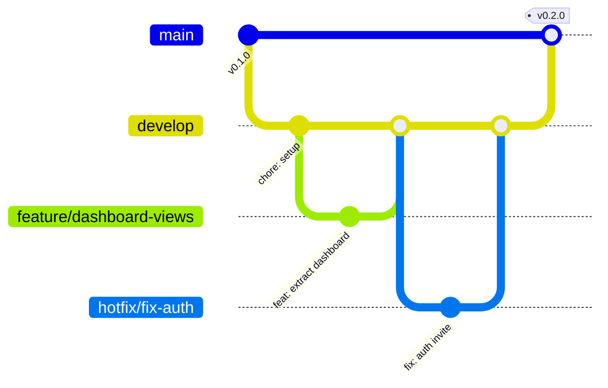

# Governança do Repositório — Report Executivo Qualidade

Este documento detalha o modelo de governança, estratégia de ramificação (branching), padrões de mensagens de commit (Conventional Commits) e o ciclo de vida de desenvolvimento adotado no projeto.

---

## 1. Estratégia de Ramificação (Branching Strategy)

Seguimos um modelo híbrido inspirado no GitFlow simplificado, ideal para entregas contínuas com alta estabilidade.



### Branches Principais

1. **`main` (Produção):**
   - Rígida e altamente estável.
   - Reflete o código atualmente em produção.
   - Protegida contra pushes diretos. Qualquer alteração deve vir via Pull Request (PR) de `develop`.
   - Cada merge na `main` gera uma nova tag de versão seguindo o **Versionamento Semântico (SemVer)**.

2. **`develop` (Homologação/Integração):**
   - Branch principal de integração.
   - Contém as últimas features concluídas e prontas para homologação.
   - Integra as branches de `feature/*` concluídas.

### Branches Auxiliares

1. **`feature/*` (Novas Funcionalidades / Refatorações):**
   - Criadas a partir de `develop`.
   - Nomenclatura: `feature/nome-da-funcionalidade` ou `feature/refactor-modulo`.
   - Exemplo: `feature/capacity-panel-refactor`.
   - Mescladas de volta para `develop` após aprovação do PR e passagem nos testes de CI.

2. **`hotfix/*` (Correções Urgentes em Produção):**
   - Criadas diretamente a partir da `main`.
   - Nomenclatura: `hotfix/descricao-do-erro`.
   - Mescladas na `main` (gerando nova release) e simultaneamente na `develop` para garantir consistência.

---

## 2. Padrão de Commits (Conventional Commits)

Todas as mensagens de commit devem seguir a convenção de Commits Semânticos, em **Português (PT-BR)** ou **Inglês**, mantendo a uniformidade.

### Estrutura da Mensagem

```
<tipo>(<escopo>): <descrição curta>

[corpo opcional com mais detalhes]

[rodapé opcional com referências a tarefas/issues]
```

### Tipos Permitidos

- **`feat`**: Uma nova funcionalidade (ex: `feat(board): adiciona drag-and-drop no Kanban`).
- **`fix`**: Correção de um bug (ex: `fix(api): corrige rate limit no invite de admin`).
- **`refactor`**: Alterações de código que não corrigem bugs nem adicionam features (ex: `refactor(views): decompoe God Component do orquestrador`).
- **`style`**: Mudanças que não afetam o significado do código (espaços, formatação, CSS hardcoded) (ex: `style(globals): alinha cores hex com design-tokens`).
- **`docs`**: Alterações na documentação (ex: `docs(api): documenta schema do invite`).
- **`chore`**: Atualizações de tarefas de build, pacotes npm, configurações de ferramentas (ex: `chore(deps): atualiza recharts para v3`).
- **`ci`**: Mudanças nos scripts e configurações de CI/CD (ex: `ci(workflows): adiciona build cache no github actions`).
- **`test`**: Criação ou ajuste de testes (ex: `test(auth): adiciona smoke test para endpoint health`).

---

## 3. Fluxo de Pull Requests (PR) e Code Review

1. **Validação Local Pré-PR:**
   - Antes de abrir um PR, o desenvolvedor deve garantir que as validações básicas passam localmente:
     ```bash
     npm run lint
     npx tsc --noEmit
     npm run build
     ```
2. **Abertura do PR:**
   - Preencher completamente o modelo definido em `.github/pull_request_template.md`.
   - O PR para `develop` exige que os testes automatizados do GitHub Actions (Lint, Typecheck, Build) passem com sucesso.
3. **Revisão:**
   - Exigência de pelo menos 1 aprovação (Peer Review) para branches críticas.
   - Commits como "WIP" ou "fix stuff" devem ser agrupados (_squashed_) antes do merge final.

---

## 4. Versionamento Semântico (SemVer)

O projeto segue as regras do SemVer 2.0.0 (`MAJOR.MINOR.PATCH`):

- **`MAJOR` (Maior):** Versões com quebras de compatibilidade de APIs públicas ou grandes redesenhos do produto.
- **`MINOR` (Menor):** Novas funcionalidades compatíveis com versões anteriores (novas visões, exportadores).
- **`PATCH` (Correção):** Correções de bugs retrocompatíveis.
